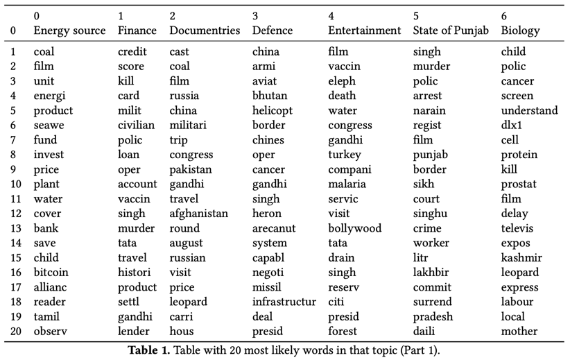
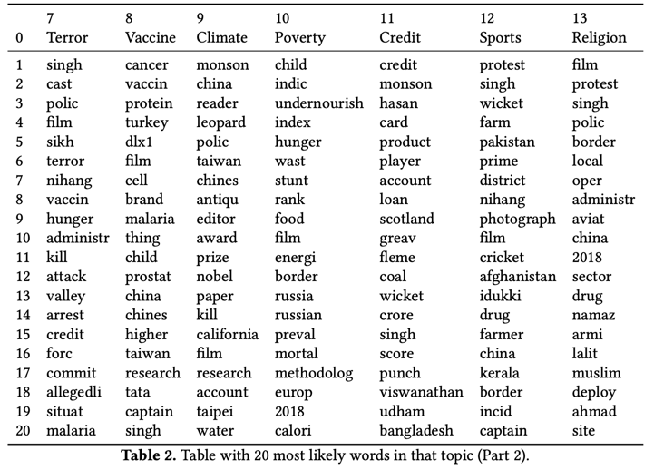
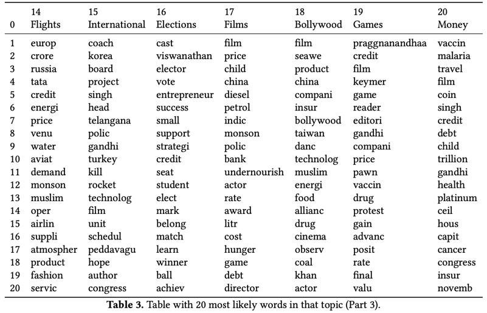
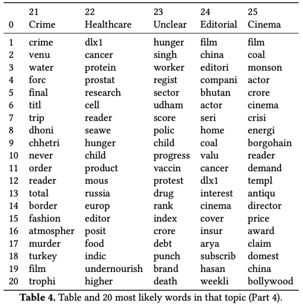

# TopicModeling
Topic modeling on articles using LDA(Latent Dirichlet Model) model

A news website 'https://www.thehindu.com' has been analysed.

### Scraping and preprocessing:
A script has been written using beautifulsoup, which downloads the latest articles from the website.
The script does not hardcode any sites other than the homepage.

The retrieved articles are written to file called 'articles.json', where each line represents one article.
Each article has fields: title, author, date, body and preprocessed
* **Body** contains the entire text of the article.
* If title, author or date could not be found, **None** is entered. 
* **Body** does not contain hyperlinks or media. 
* **Body** is at least 100 words long to get accurate topic from it.
* **Preprocessed** field removes stop words, lemmatizes and stems words.

### Analysis:
* To train the LDA model, the preprocessed body text has been used and converted into a bag of words. 
* Gensim LDA model was used to build the model by giving the number of topics as a parameter. 
* A model has been created against the data with a number of topics between 10 to 30.
* This trained data will be useful in determining the topic of any future articles.

### Results:
Result obtained from the projection of articles into the topic model are given below. 
For each topic, an article where that topic is the most likely is found.

Topic: 0 with header ’Energy source’ 
Article name: Explained | What is the extent of India’s coal crisis? - The Hindu 
Article Date: October 17, 2021 03:45 IST 

Topic: 1 with header ’Finance’ 
Article name: Credit score myths that can harm financial health - The Hindu 
Article Date: October 17, 2021 22:48 IST

Topic: 2 with header ’Documentaries’ 
Article name: A precis on Dr. S. Krishnaswamy, the quin- tessential Indian documentary filmmaker - The Hindu 
Article Date: None

Topic: 3 with header ’Defence’ 
Article name: UAVs, Aviation unit boost Army surveillance in eastern sector - The Hindu 
Article Date: October 17, 2021 21:11 IST

Topic: 4 with header ’Entertainment’ 
Article name: A precis on Dr. S. Krishnaswamy, the quin- tessential Indian documentary filmmaker - The Hindu  
Article Date: None

Topic: 5 with header ’State of Punjab’ 
Article name: Singhu murder: 1 more arrested, 2 ‘surrender’- The Hindu 
Article Date: October 16, 2021 22:51 IST

Topic: 6 with header ’Biology’ 
Article name: IIT Kanpur team identifies a novel target to treat prostate cancer - The Hindu 
Article Date: October 16, 2021 21:07 IST

Topic: 7 with header ’Terror’ 
Article name: Credit score myths that can harm financial health - The Hindu 
Article Date: October 17, 2021 22:48 IST

Topic: 8 with header ’Vaccine’ 
Article name: IIT Kanpur team identifies a novel target to treat prostate cancer - The Hindu 
Article Date: October 16, 2021 21:07 IST

Topic: 9 with header ’Climate’ 
Article name: How the law caught up with an artful dodger in Kerala - The Hindu 
Article Date: October 16, 2021 00:04 IST

Topic: 10 with header ’Poverty’ 
Article name: Alarming hunger or statistical artefact? - The Hindu 
Article Date: October 18, 2021 00:15 IST

Topic: 11 with header ’Credit’ 
Article name: Credit score myths that can harm financial health - The Hindu 
Article Date: October 17, 2021 22:48 IST

Topic: 12 with header ’Sports’ 
Article name: ICC T20 World Cup 2021 — history, full squads and fixtures of all teams - The Hindu 
Article Date: October 10, 2021 15:23 IST

Topic: 13 with header ’Religion’ 
Article name: Jumma Namaz: Efforts to find amicable solu- tion in Gurugram prove to be futile - The Hindu 
Article Date: October 17, 2021 22:24 IST

Topic: 14 with header ’Flights’ 
Article name: Explained | Will the Tatas be able to turn around Air India? - The Hindu 
Article Date: October 17, 2021 03:30 IST

Topic: 15 with header ’International’ 
Article name: A precis on Dr. S. Krishnaswamy, the quin- tessential Indian documentary filmmaker - The Hindu  
Article Date: None

Topic: 16 with header ’Elections’ 
Article name: State elections, limits of caste-based strate- gies - The Hindu 
Article Date: October 18, 2021 00:02 IST

Topic: 17 with header ’Films’ 
Article name: How the law caught up with an artful dodger in Kerala - The Hindu 
Article Date: October 16, 2021 00:04 IST

Topic: 18 with header ’Bollywood’ 
Article name: It is time to rise in defence of Bollywood - The Hindu 
Article Date: October 16, 2021 00:02 IST

Topic: 19 with header ’Games’ 
Article name: Credit score myths that can harm financial health - The Hindu 
Article Date: October 17, 2021 22:48 IST

Topic: 20 with header ’Money’ 
Article name: Explained | U.S. plan for $1 trillion platinum coin to address debt crisis - The Hindu 
Article Date: October 13, 2021 12:43 IST

Topic: 21 with header ’Crime’ 
Article name: A precis on Dr. S. Krishnaswamy, the quin- tessential Indian documentary filmmaker - The Hindu  
Article Date: None

Topic: 22 with header ’Healthcare’ 
Article name: IIT Kanpur team identifies a novel target to treat prostate cancer - The Hindu 
Article Date: October 16, 2021 21:07 IST

Topic: 23 with header ’Unclear’ 
Article name: Alarming hunger or statistical artefact? - The Hindu 
Article Date: October 18, 2021 00:15 IST

Topic: 24 with header ’Editorial’ 
Article name: A precis on Dr. S. Krishnaswamy, the quin- tessential Indian documentary filmmaker - The Hindu 
Article Date: None

Topic: 25 with header ’Cinema’ 
Article name: How the law caught up with an artful dodger in Kerala - The Hindu 
Article Date: October 16, 2021 00:04 IST

